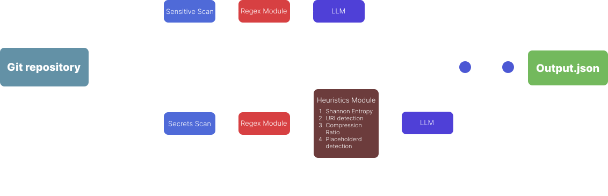

# Getting started!
This is my solution for a LLM-powered scanner for Git repositories. The tool is able to scan remote and local repositories for passwords, api-tokens, database-URIs as well as for sensitive data like phone numbers, cards numbers, etc.

# Simple scanning-steps illustration 

# Overview
This tool is a repositories-scanner written in Python. It uses modified [secret-patterns-db](https://github.com/mazen160/secrets-patterns-db?tab=readme-ov-file) for regular expressions as a part of heuristic-powered detection of potential secrets/sensitive data. The scanner uses mainly `meta-llama/llama-4-scout-17b-16e-instruct` as a LLM model. I used [Groq](https://groq.com/) to test my solution.

### CLI
**Mandatory arguments**:
1. `--repo`: Specifies path to a local repository or an URL to a remote repository
2. `--n`: Specifies count of last commits to be analyzed
3. `--out`: Specifies name of the output file

**Optional arguments**:
1. `--sensitive`: Changes the mod to sensitive data scan. The tool will only recognize phone numbers, card numbers, emails, etc.

### Scanning
**The tool uses two steps scanning**:
1. **Heuristic-scan**: I use regular expressions as a first signal about whether some token (by token I mean some section of text) could be dangerous. If high-confidence regex detects some token and there are no other nuances, the token will be instantly marked as a `secret` bypassing the LLM. If detection occures, I use several techniques to reduce noise:
    - **Primary filter**: The most long and confident match will be used in further study
    - **URI detection**: If URI was matched, it will be parsed statically to determine whether it has credentials (password and username)
    - **Entropy**: Shannon entropy of the string is being calculated
    - **Decision**: Based on whether the rule, which has detected the token has "low" confidence, token is similar to the example, similar to human text or its compression-ratio is below a certain minimum, the `should_escalate` function decides, whether token should be studied by the LLM.

2. **LLM-powered verification**: The next step, if escalated, is LLM-analysis. At this step the preprompted LLM gets further information:
    - **Id** of the detection
    - **Regex Rule** that detected the token
    - **Value** of the token
    - **Name of the file** containing the token in this commit
    - **Shannon entropy** of the token
    - **Context** - 3 lines above the token, the token-line, 3 lines beyong the token
    - **Commit message** of the commit that contains the token
    - **Status of URI detection** indicating potentially dangerous URI

First step is almost fully ignored if `--sensitive` is enabled.
    

# Getting started
### 1. Clone the repository
`git clone https://github.com/masqquerade/jb_llm_cs_integration.git`

`cd jb_llm_cs_integration`

### 2. Create .env file in root of the repository
The tool requires two environment variables to work:

    1. LLM_MODEL - Select any model which is supported by Groq and supports Json-output
    2. API_TOKEN - Your Groq API token
    
### 3. Activate virtual environment
`python -m venv venv`

**Windows**:

`.\.venv\Scripts\activate`

**Linux/MacOS**:

`source venv/bin/activate`

### 4. Install dependencies
`pip install -r requirements.txt`

### Usage
`python -m src.main --repo <URL|path> --n <count of commits> --out <output file> --sensitive (optional)`
